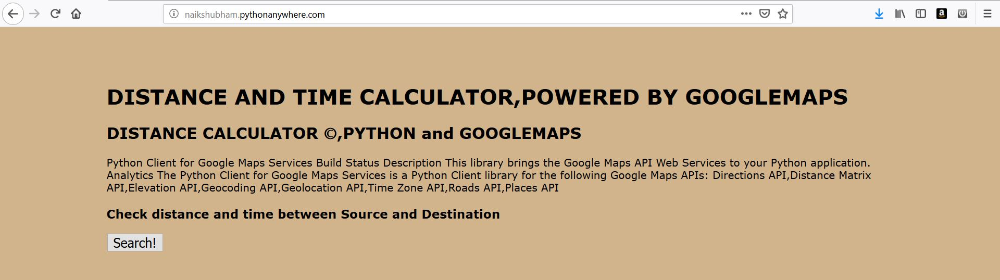
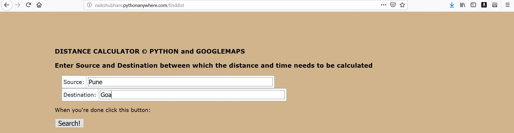
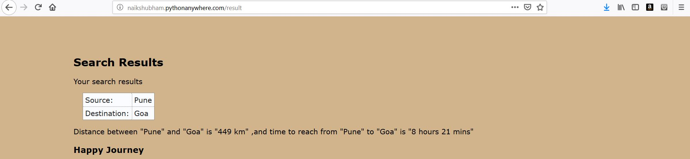

# Distance Calculator Webapp using Flask and Google Map API

- Google Map Distance Matrix API is a service that provides travel distance and time taken to reach destination. This API returns the recommended route(not detailed) between origin and destination, consists of duration and distance values for each pair.

- To use this API, one must need the API key, which can be get from https://developers.google.com/maps/documentation/distance-matrix/get-api-key

## Packages required

- Programming language - Python
- Flask
- googlemaps
- datetime

Using googlemaps module :
- Distance between two places can also be calculated using googlemaps module.

- Command to install googlemaps module : 
pip install googlemaps

## Results

- Start page

- Enter source and destinations

- Result

